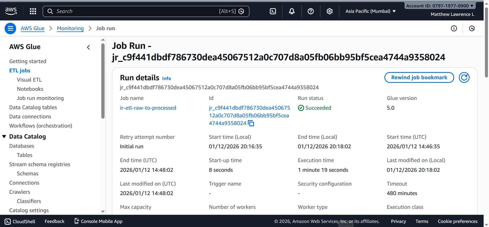
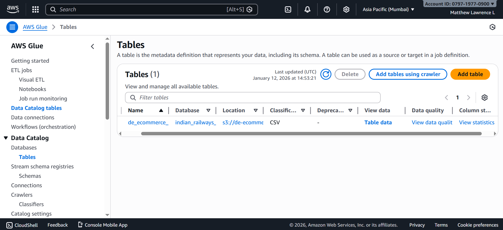
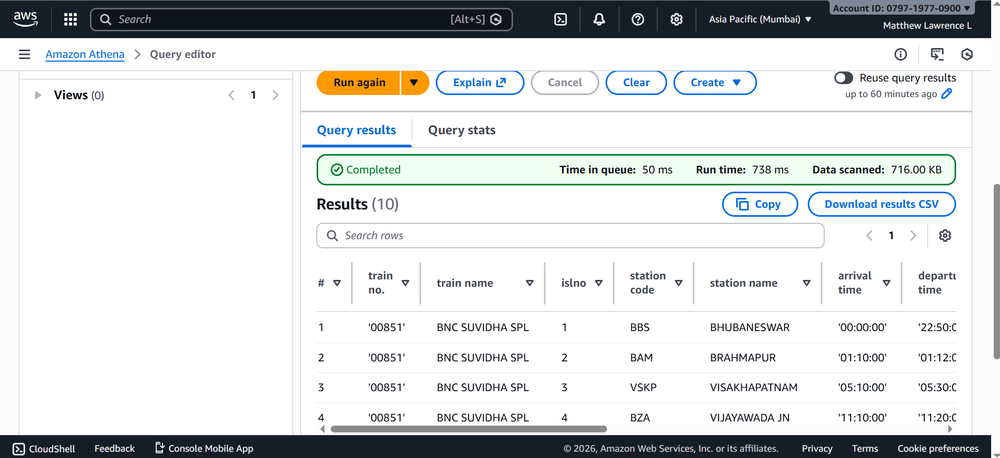

# AWS Data Engineering – Indian Railways Analytics

## Overview
This project demonstrates an end-to-end AWS data engineering pipeline built completely using AWS managed services.
The pipeline processes real Indian Railways data using AWS Glue (PySpark) and enables SQL analytics using Amazon Athena.

## Architecture
Raw CSV Data
→ Amazon S3 (raw zone)
→ AWS Glue (PySpark ETL)
→ Amazon S3 (processed zone – Parquet)
→ AWS Glue Data Catalog
→ Amazon Athena (SQL Analytics)

## AWS Services Used
- Amazon S3 (Data Lake)
- AWS Glue (PySpark ETL)
- AWS Glue Crawler & Data Catalog
- Amazon Athena

## Data Flow
1. Raw Indian Railways CSV data ingested into S3
2. PySpark ETL job in AWS Glue cleans and standardizes schema
3. Data converted from CSV to Parquet
4. Processed data registered using Glue Crawler
5. SQL analytics performed using Athena

## Project Proof (AWS Console Screenshots)

### Amazon S3 – Data Lake Structure
Raw and processed data stored in Amazon S3.

### AWS Glue – Spark ETL Job
PySpark ETL job executed successfully in AWS Glue.

### AWS Glue Data Catalog
Processed dataset registered using Glue Crawler.

### Amazon Athena – SQL Analytics
SQL queries executed successfully on processed data.

## Notes
- Entire project implemented inside AWS Console
- No local execution or external scripts used
- Architecture and results documented for demonstration
